# Explanation file

# Hello! This file contains the explanation for the code changes.
Order goes from Critical issues to minor issues but in the order (SEC, VAL, UI)
### Critical issues:
#### SEC-301: SSN Storage:
My solution was to encrypt the SSN string. If we're not using for anything else, or just using it to verify the uniqueness of the user, then we could have hashed it, since this is a bank, we may have to retrieve it for various reasons (legal compliance, credit score check etc.).

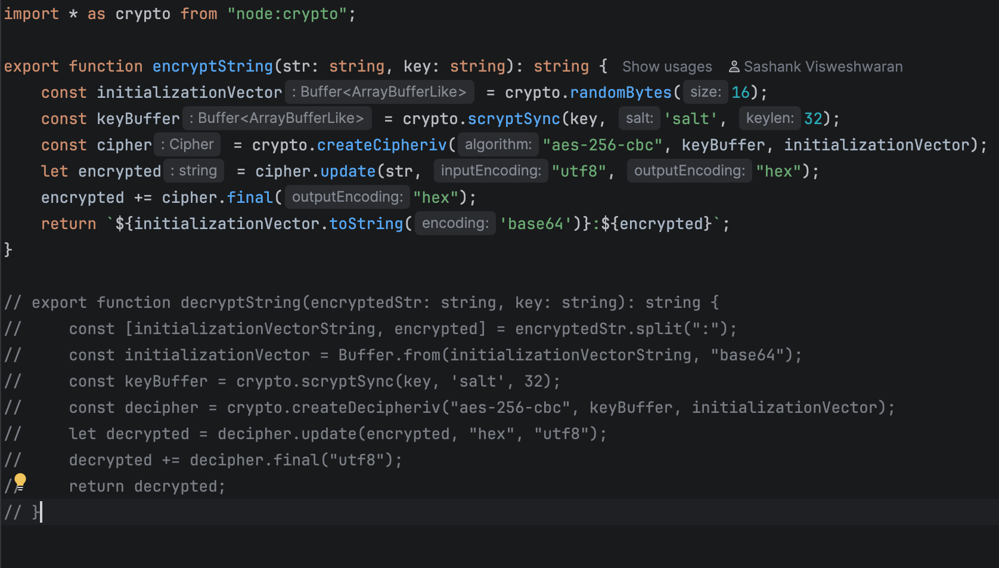

While we aren't using the SSN for anything else, we may want to use it in the future, so I added a decryption method which we could call.

#### SEC-303: XSS Vulnerability:
React escapes HTML by default, so we just need to make sure we're not using dangerouslySetInnerHTML or something similar. So, I removed it.

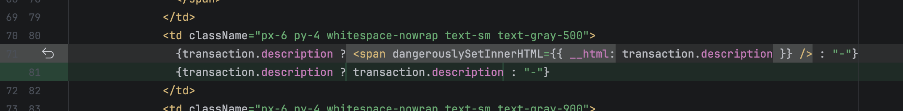

#### PERF-401: Account Creation Error:
There was a place holder object which is being returned, but the amount was set to 100 by default. This object would return if the account was undefined (It wasn't created).

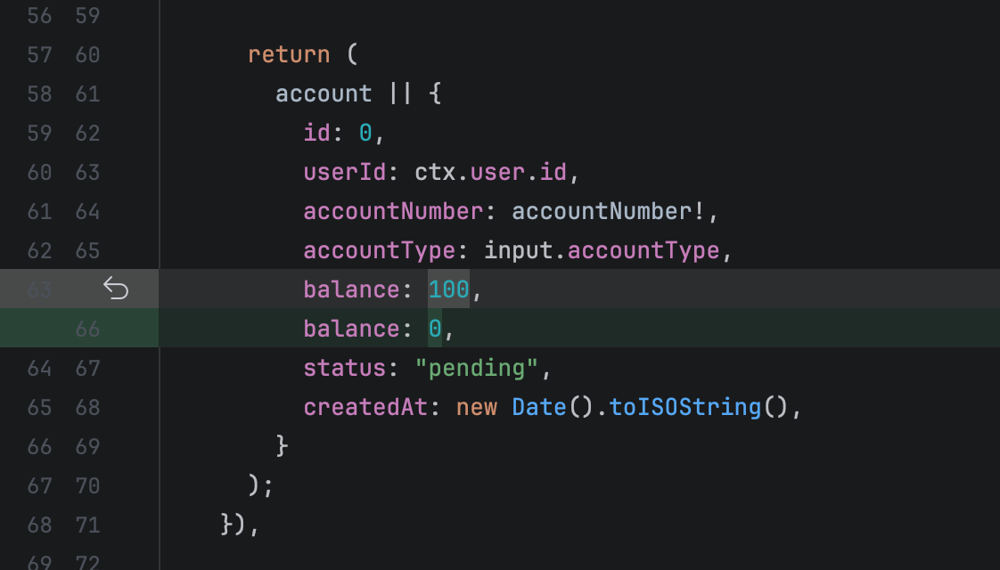

But in my opinion, this is not the best way to handle it. It must fail loudly!
So, I changed it to this:
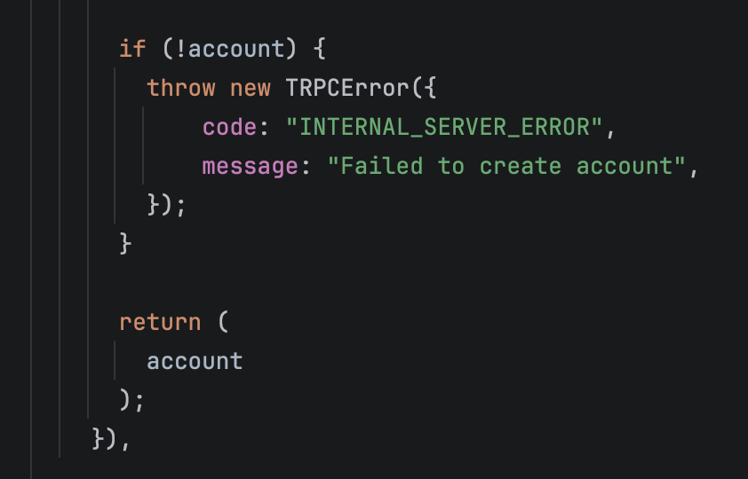

#### PERF-405: Missing Transactions:
TransactionList component was not being re-rendered to trigger a new API request, and hence the transaction list was being updated in the UI, moved the fetching part up the tree and refetch it after adding funds.

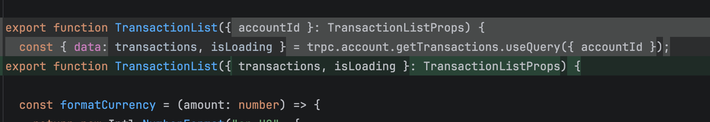

And also for some reason, the transaction that was being returned was not the one that was just added, so I fixed that as well.

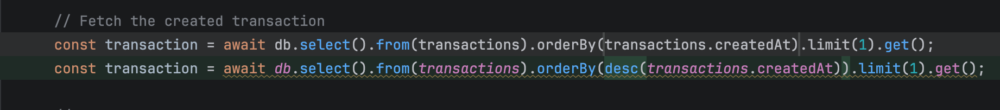

#### PERF-406: Balance Calculation:
The balance was being calculated by summing up amount/100 100 times. As a result:
1. We lose floating point precision
2. It's inefficient to loop through the transactions 100 times, so it slows it down when there is a lot of traffic. Fixing this would fix PERF-407: Performance Degradation too.

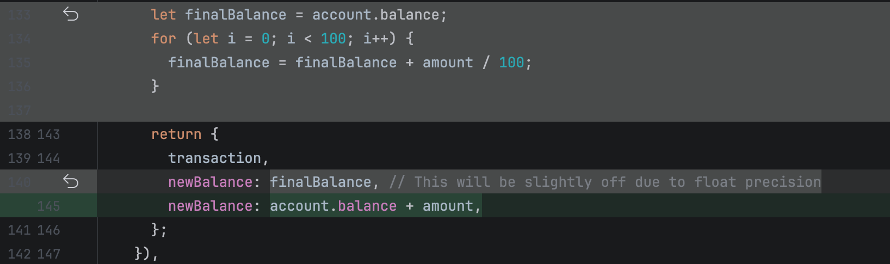

Also, I put the whole thing in a <strong>DB transaction</strong>, so, if there is an error after inserting a transaction entry but before updating account balance, it would roll back.

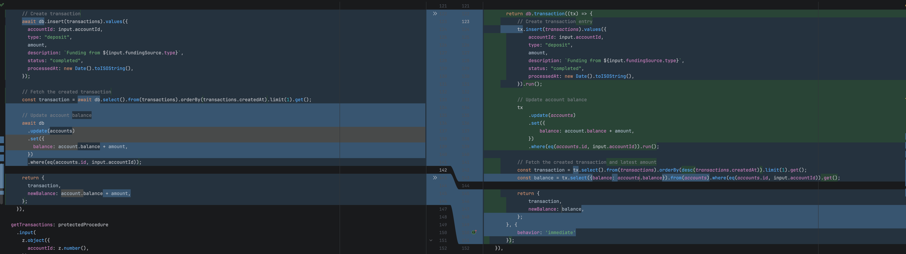

#### PERF-408: Resource Leak:
We're using a connection array, and it's not like we have a list of shards or something, so I got rid of it.

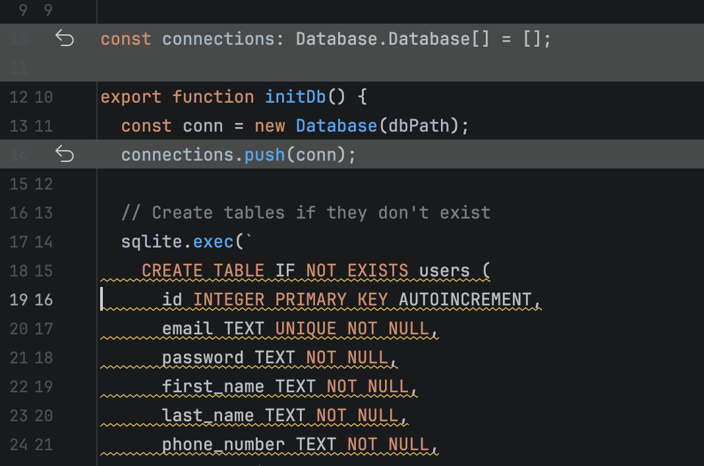

Also, we're not closing the single connection as well, so I'm closing it after using.

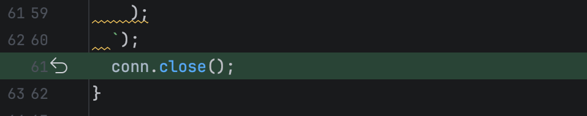

### High issues:
#### SEC-302: Insecure Random Numbers:
Math.random() is insecure, so moved it to use the randomBytes method from the crypto module.
Also, I generated only 9 digits randomly, the 10th digit was the Luhn checksum that was run on the 9 digits. This way, we could avoid user typo errors to some extent.

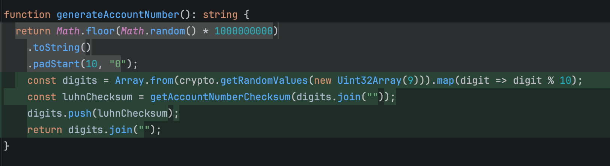

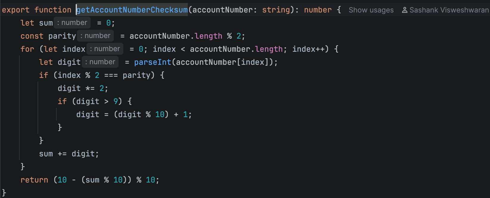

#### SEC-304: Session Management:
Preventing multiple concurrent sessions by deleting all the user's prior tokens before inserting a new one.

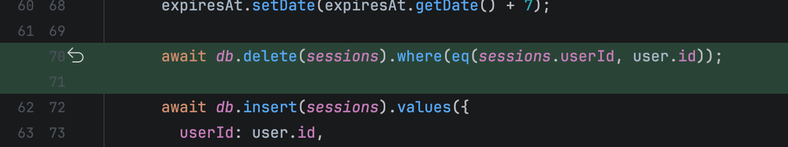

#### PERF-403: Session Expiry:
Added a last used at column in the DB which get updated each time the user makes a request using this token.
If the last used at is more than 30 minutes ago, then we consider the session expired and delete the token from the DB.
Also, if we have less than 60 minutes before the token expires, we delete the user's session and ask them to login again.

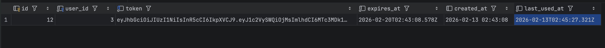

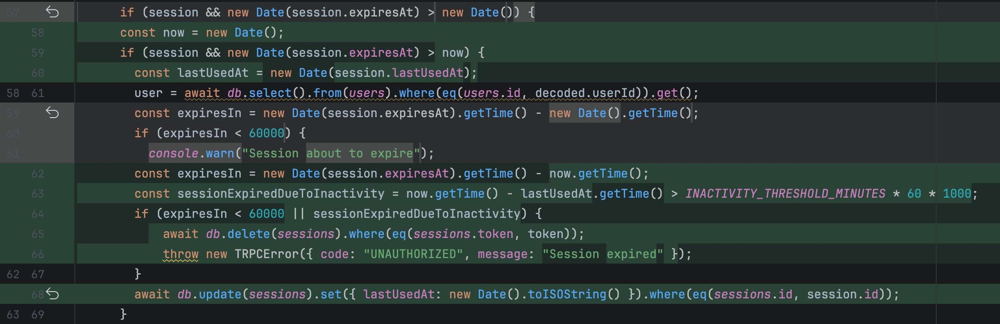

#### PERF-407: Performance Degradation:
The one of the fixes that I had mentioned in PERF-406 would fix this as well.

#### VAL-201: Email Validation Problems:
Changed the regex to check for domain suffixes. Added a few, but we could add more as needed.
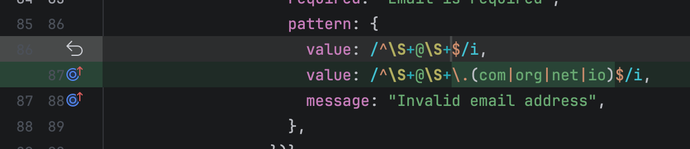

Fixed the auto lower case issue as well; fixed it in the zod schema.

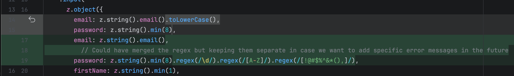

And just because we're leaving the case as it is, doesn't mean there can be 2 equivalent email addresses with different casing. So, I added validation for that as well.

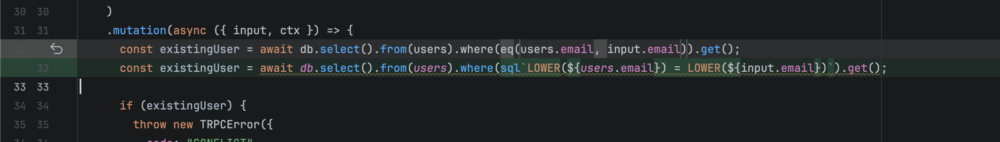

#### VAL-205: Zero Amount Funding:
Added validation to check if the amount is greater than 0.

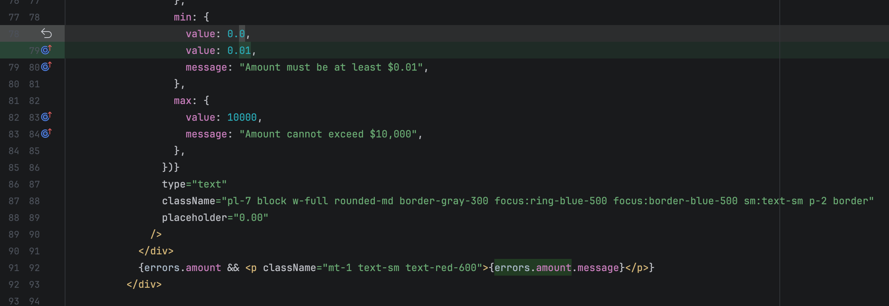

Also, from the looks of it, it looks like we're also limiting the max deposit to 10000 per transaction, so added that in the zod schema.

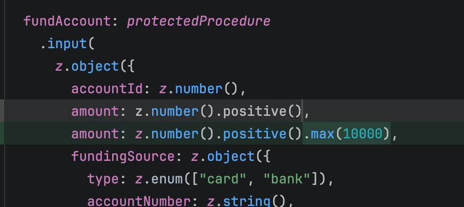

#### VAL-207: Routing Number Optional:
Added validation to check if account type is bank, and then check if it's not empty.

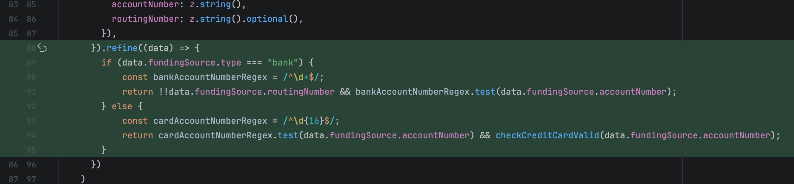

#### VAL-210: Card Type Detection:
Used the Luhn algorithm to validate the card number, both in the input field and in the zod schema.

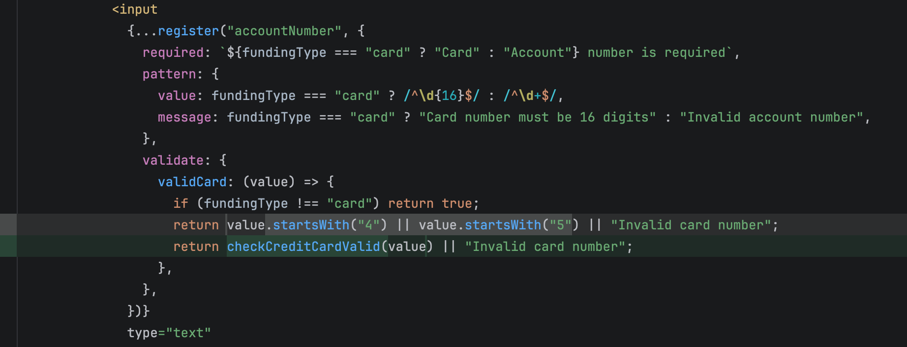

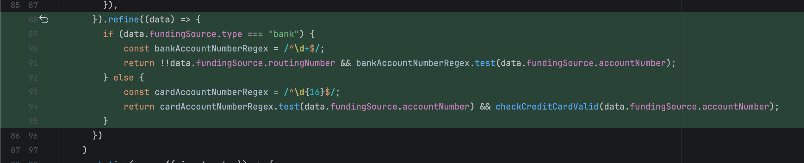

Luhn's algorithm:

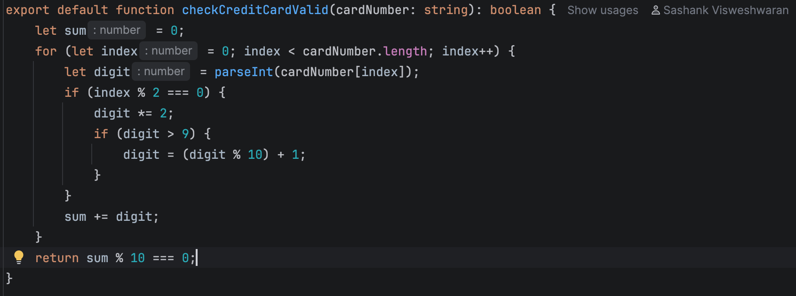

### Medium issues:
#### PERF-402: Logout issues:
Session was not being deleted from the DB, because the token was being fetched incorrectly. So, I fixed it.

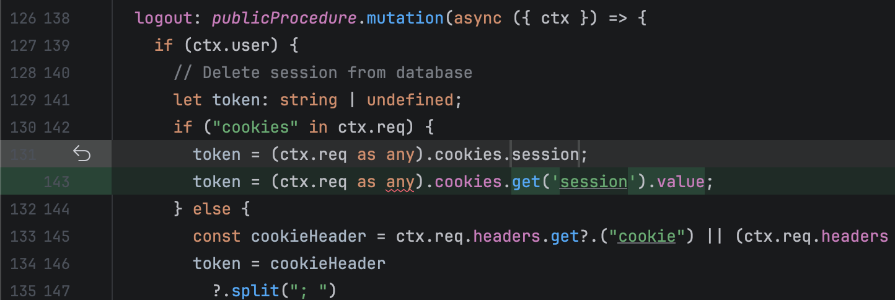

#### PERF-404: Transaction Sorting:
Transaction was not being sorted in any manner, so I sorted it by descending order of transaction time.

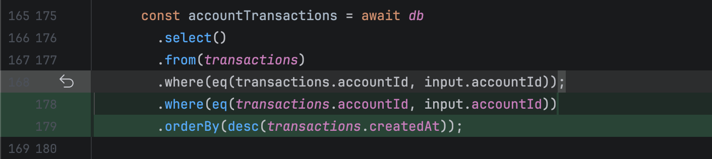

#### VAL-203: State Code Validation:
Added a set of state codes since we're only supporting US states, and added validation to check if the state code exists in the list.

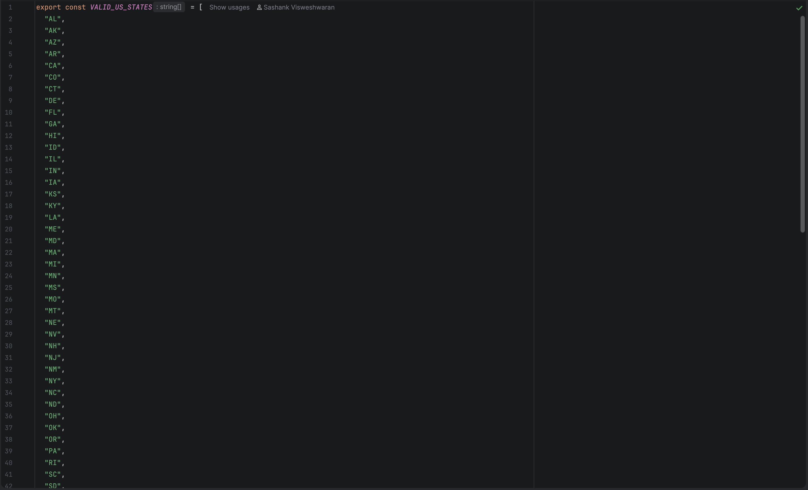

Added it to the zod schema as well.

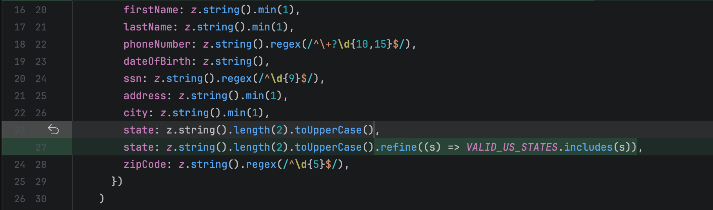

#### VAL-204: Phone Number Validation:
Changed the regex to accept + at the beginning since it looks like we're supporting international numbers. Also changed it to accept anywhere from 10-16 digits since its international.
Had to change only in the field since the zod schema looked fine.

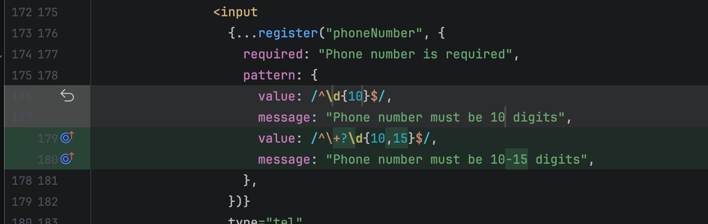

#### VAL-209: Amount Input Issues:
Added a regex to check if the amount has leading 0s. Not a problem in the backend since we're parsing it as float anyway.

